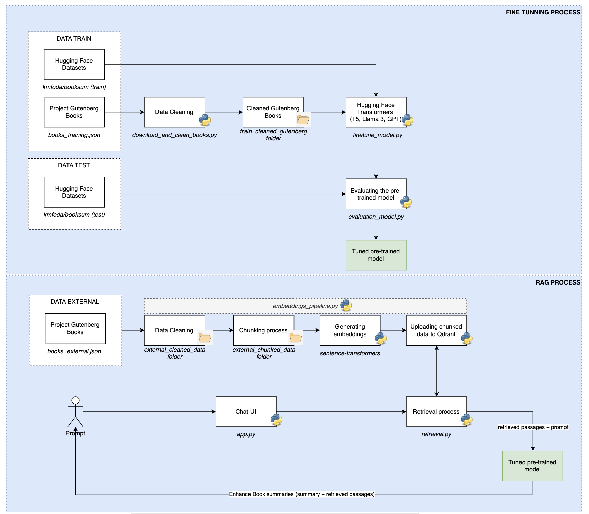

# LLM Augmentation with Project Gutenberg Catalog

This project aims to augment a Large Language Model (LLM) using the Project Gutenberg Catalog to create detailed book summaries.

## Objective

Augment an LLM to generate comprehensive summaries of books from the Project Gutenberg Catalog.

## Application Architecture Design



The diagram above provides a high-level overview of the application architecture for augmenting an LLM using the Project Gutenberg Catalog. It outlines the various components and their interactions within the system, from data ingestion and cleaning to model training and deployment. For a detailed view, you can access the architecture design via [this link](https://app.diagrams.net/#G1Xz3PGGhGBTxHArLhelrL2hN0-QDMBYj2#%7B%22pageId%22%3A%22O23dWRMm1G2P5rXFUwsT%22%7D).

## Project Structure

- **download_and_clean_books.py**: Script to download books from Project Gutenberg, clean the text, and save the processed text.
- **finetune_model.py**: Script to fine-tune the LLM model using the cleaned book data and the BookSum dataset.
- **evaluation_model.py**: Script to evaluate the fine-tuned model using ROUGE and BLEU metrics.
- **optimize_model.py**: Script to optimize model hyperparameters using Optuna.
- **embeddings_model.py**: Script to generate embeddings from the cleaned book data and upload them to Qdrant.
- **retrieval.py**: Script to retrieve relevant documents from Qdrant and generate responses using the LLM.
- **app.py**: Streamlit application to interact with the LLM and generate book summaries.

## Installation

1. Navigate to your project repository:
    ```bash
    cd your-project-repo-name
    ```

2. Create python environment
    ```bash
    conda create -n your-env-name python=3.10
    ```

3. Activate the environment
    ```bash
    conda activate your-env-name
    ```

4. Install the required dependencies:
    ```bash
    pip install -r requirements.txt
    ```

5. Install Docker and sign-in
    ```bash
    docker login
    ```
    - Username: ''
    - Password: ''

6. Once Docker is installed, pull the Qdrant image:
    ```bash
    docker pull qdrant/qdrant
    ```

7. Run the Qdrant container:
    ```bash
    docker run -p 6333:6333 qdrant/qdrant
    ```

8. Configure Git to store credentials:
    ```bash
    git config --global credential.helper store
    ```

9. Log in to Hugging Face:
    ```bash
    huggingface-cli login
    ```

10. Set up the environment variables for Hugging Face API token (.env file):
    ```bash
    export HUGGING_FACE_API_TOKEN='your-hugging-face-api-token'
    ```

11. If you decided to use my personal repo: Clone the repository:
    ```bash
    git clone https://github.com/your-username/your-repo-name.git
    cd your-repo-name
    ```

## Usage

### Download and Clean Books

Run the script to download and clean books from Project Gutenberg:
```bash
python download_and_clean_books.py
```

### Fine-tune the Model

Run the script to fine-tune the LLM model:
```bash
python finetune_model.py
```

### Evaluate the Model

Run the script to evaluate the fine-tuned model:
```bash
python evaluation_model.py
```

### Generate Embeddings and Upload to Qdrant

Run the script to generate embeddings and upload them to Qdrant:
```bash
python embeddings_pipeline.py
```

### Initialize the Qdrant client

Copy and paste this URL to validate the Qdrant collection
http://localhost:6333/dashboard

### Retrieval and Response Generation

Run the script to retrieve relevant documents from Qdrant and generate responses using the LLM:
```bash
python retrieval.py
```

### Streamlit Application

Run the Streamlit application to interact with the LLM and generate book summaries:
```bash
streamlit run app.py
```

## Project Files

### download_and_clean_books.py
- Downloads books from Project Gutenberg.
- Cleans the text by removing introductory text and unwanted characters.
- Saves the cleaned text to a specified directory.

### finetune_model.py
- Loads and preprocesses book data and the BookSum dataset.
- Fine-tunes the LLM model.
- Saves the fine-tuned model and tokenizer.

### evaluation_model.py
- Evaluates the fine-tuned model using ROUGE and BLEU metrics.
- Prints evaluation results for each model.

### optimize_model.py
- Uses Optuna for hyperparameter optimization.
- Fine-tunes the model with optimized hyperparameters.
- Prints the best trial results.

### embeddings_model.py
- Downloads, cleans, and chunks text data.
- Generates embeddings for the chunked text.
- Uploads embeddings to Qdrant.

### retrieval.py
- Retrieves relevant documents from Qdrant based on a question.
- Generates responses using the LLM.
- Evaluates the generated summary using ROUGE and BLEU metrics.

### app.py
- Streamlit application to interact with the LLM and generate book summaries.
- Provides a user interface for inputting questions and evaluating summaries.

## Acknowledgments

- [Project Gutenberg](https://www.gutenberg.org/)
- [Hugging Face](https://huggingface.co/)
- [Qdrant](https://qdrant.tech/)
- [Docker Hub for Qdrant](https://hub.docker.com/r/qdrant/qdrant)
- [Optuna](https://optuna.org/)
- [LangChain](https://langchain.org/)

## License

This project is licensed under the MIT License. See the [LICENSE](LICENSE) file for details.
